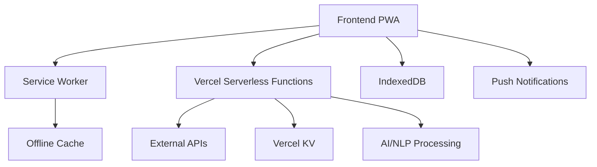

# Pulse Pro - Amazon Fulfillment Center PWA

A comprehensive Progressive Web App for Amazon Fulfillment Centers, providing real-time orchestration, AI-driven insights, and gamified learning experiences.

## Features

- WES Orchestration & Real-time Event Processing
- AI-Driven Performance Engine
- Voice-Directed Task Guidance
- Gamification & Microlearning
- Digital Signage & Kiosk UI
- AI-Powered Behavioral Nudges
- Anonymous Sentiment Analytics
- Predictive Scheduling & Attrition Alerts
- Zone-Level Manager Dashboards

## Tech Stack

- **Frontend**: React (TypeScript) PWA via Vite
- **Backend**: Node.js Serverless Functions on Vercel
- **AI/NLP**: spaCy for sentiment analysis
- **Data Storage**: Vercel KV, IndexedDB
- **Authentication**: JWT/OAuth2
- **Deployment**: Vercel

## Architecture



## Deployment Instructions

1. Fork this repository
2. Connect to Vercel:
   - Go to [Vercel](https://vercel.com)
   - Import your forked repository
   - Set up the following environment variables:
     ```
     JWT_SECRET=your-secret-key
     VERCEL_KV_URL=your-kv-url
     VERCEL_KV_REST_API_URL=your-kv-rest-url
     VERCEL_KV_REST_API_TOKEN=your-kv-token
     ```
3. Deploy!

## Development Roadmap

### Phase 1 (MVP) - Week 1-2
- Basic PWA setup with offline support
- WES event processing
- Simple performance metrics
- Basic kiosk UI

### Phase 2 - Week 3-4
- AI-driven insights
- Gamification features
- Voice guidance system
- Sentiment analysis

### Phase 3 - Week 5-6
- Predictive scheduling
- Advanced analytics
- Mobile optimization
- Performance improvements

## License

MIT License 